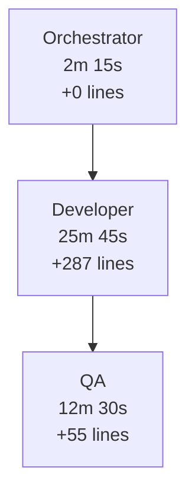

# # Multi-Agent Development Setup Multi-Agent Development Setup

This repository contains Claude Code's multi-agent development system. Here's how to use it in your own projects.

## ## Quick Setup for New Projects (30 seconds) Quick Setup for New Projects (30 seconds)

### Option 1: Use This Entire Repository as Template
1. **Fork or download** this repository
2. **Customize** the `CLAUDE.md` file for your project
3. **Update** `src/main.py` with your actual application code
4. **Start using** the agents immediately!

### Option 2: Add to Existing Repository (Recommended)
```bash
# 1. Download this template
git clone <this-repo-url> multi-agent-template
cd multi-agent-template

# 2. Run the automated setup script
python setup_multiagent.py /path/to/your/existing/repo

# 3. Clean up
cd ..
rm -rf multi-agent-template
```

### Option 3: Interactive Setup
```bash
# Download template
git clone <this-repo-url> multi-agent-template
cd multi-agent-template

# Dry run to see what will be installed
python setup_multiagent.py /path/to/your/repo --dry-run

# Install to your repository
python setup_multiagent.py /path/to/your/repo

# Navigate to your repo and test
cd /path/to/your/repo
python scripts/log-agent-activity.py --stats
```

## ## Smart Conflict Detection & Safety Smart Conflict Detection & Safety

The `setup_multiagent.py` script includes advanced conflict detection:

### ### Conflict Analysis **Conflict Analysis**
- **# Multi-Agent Development Setup Claude Agents** - Detects existing agent conflicts (CRITICAL)
- **Scripts Scripts** - Identifies script overwrites  
- **Config Files Config Files** - Warns about data loss (logs, settings)
- **Documentation Documentation** - Notes markdown file conflicts

### ## Smart Conflict Detection & Safety **Safety Features**
- [OK] **Git validation** - Ensures target is a git repository
- [OK] **Automatic backups** - Creates timestamped backups with `--force`
- [OK] **Dependency validation** - Checks for PyYAML
- [OK] **Installation testing** - Verifies everything works after setup
- [OK] **Dry run mode** - Preview changes and conflicts before applying

### Example **Example Conflict Report**
```
[WARNING]  CONFLICTS DETECTED: 4 files would be overwritten
# Multi-Agent Development Setup CLAUDE AGENTS (2 conflicts):
   [ERROR] .claude/commands/orchestrator.md - Your existing 'orchestrator' agent would be replaced
   [ERROR] .claude/commands/cleanup.md - Your existing 'cleanup' agent would be replaced

Example RECOMMENDATIONS:
   [CRITICAL] CRITICAL: 2 Claude agent conflicts detected!
   Options Options:
      - Use --force to proceed anyway (creates backups)
      - Use --backup to create timestamped backups first
```

### Options **Usage Patterns**
```bash
# Preview conflicts and installation plan
python setup_multiagent.py /path/to/repo --dry-run

# Install with automatic backups if conflicts exist
python setup_multiagent.py /path/to/repo --force --backup

# Create backups without forcing installation
python setup_multiagent.py /path/to/repo --backup

# Skip git validation for non-git projects
python setup_multiagent.py /path/to/repo --skip-git-check
```

## ## What Gets Added to Your Repo What Gets Added to Your Repo

```
your-repo/
+-- .claude/
|   +-- commands/          # Agent definitions
|       +-- orchestrator.md
+-- scripts/               # Multi-agent tools
|   +-- log-agent-activity.py
|   +-- generate-flowchart.py
|   +-- scan-codebase.py
+-- logs/                  # Activity tracking
|   +-- agent-activity.yaml
+-- suggestions/           # Agent suggestions
    +-- features.md
    +-- cleanup-tracker.yaml
```

## Options Customization

### 1. Update CLAUDE.md
Add this section to your existing `CLAUDE.md` or create one:

```markdown
## Multi-Agent Development

This project uses Claude Code's 7-agent development system:
- **orchestrator** - Coordinates all agents
- **developer** - Implementation and coding
- **qa** - Testing and validation  
- **devops** - CI/CD and deployment
- **infrastructure** - Documentation and monitoring
- **innovation** - Feature suggestions
- **cleanup** - Code quality and refactoring

### Usage
```bash
# Log activities
python scripts/log-agent-activity.py --agent developer --agent-type implementation --instruction "Add feature X" --result "Feature completed" --duration 600

# View statistics  
python scripts/log-agent-activity.py --stats

# Generate workflow flowchart
python scripts/generate-flowchart.py
```

### 2. Optional: Update README
```bash
echo "" >> README.md
echo "## # Multi-Agent Development Setup Multi-Agent Development" >> README.md
echo "This repo uses Claude Code's multi-agent system. Run \`python scripts/log-agent-activity.py --stats\` to view activity." >> README.md
```

## ## Test Your Setup Test Your Setup

```bash
# Test logging system
python scripts/log-agent-activity.py \
  --agent developer \
  --agent-type implementation \
  --instruction "Test multi-agent setup" \
  --result "Setup completed successfully" \
  --duration 30

# View the logged activity
python scripts/log-agent-activity.py --stats

# Generate a flowchart
python scripts/generate-flowchart.py --condensed
```

## ## Using the Agents Using the Agents

| Agent | Command | Purpose |
|-------|---------|---------|
| **orchestrator** | `/orchestrator` | Coordinate multi-step workflows |
| **developer** | `/developer` | Implement features and fix bugs |
| **qa** | `/qa` | Add tests and validate quality |
| **devops** | `/devops` | Set up CI/CD and deployment |
| **infrastructure** | `/infrastructure` | Add monitoring and docs |
| **innovation** | `/innovation` | Suggest new features |
| **cleanup** | `/cleanup` | Refactor and improve code quality |

## ## Workflow Examples Workflow Examples

### Systematic Code Improvement
```bash
# 1. Orchestrator coordinates the workflow
/orchestrator "Review codebase and improve quality"

# 2. This automatically triggers:
#    - Cleanup agent scans for issues
#    - Innovation agent suggests improvements  
#    - QA agent adds missing tests
#    - All activities are logged automatically
```

### Feature Development
```bash
# 1. Start with orchestrator
/orchestrator "Implement user authentication system"

# 2. Follow the agent workflow:
#    developer -> qa -> devops -> infrastructure
#    All coordinated automatically with full logging
```

## ## Monitoring Progress Monitoring Progress

- **Activity Log**: `logs/agent-activity.yaml` - All agent activities with metrics
- **Cleanup Status**: `suggestions/cleanup-tracker.yaml` - Code quality tracking  
- **Feature Ideas**: `suggestions/features.md` - Innovation suggestions
- **Flowcharts**: Generate with `python scripts/generate-flowchart.py`

## ## Example Output Example Output

### Activity Statistics
```
## Using the Agents Agent Activity Statistics
========================================
Total agents run: 12
Total duration: 45m 30s  
Total lines added: 342
Total lines removed: 89
Unique files touched: 15
```

### Generated Flowchart


## Options Advanced Configuration

### Cleanup Thresholds
Edit `suggestions/cleanup-tracker.yaml`:
```yaml
thresholds:
  max_lines_per_file: 500      # Customize for your project
  max_complexity_score: 10     # Adjust complexity tolerance
  min_test_coverage: 80        # Set coverage requirements
```

### Agent Customization
Edit files in `.claude/commands/` to customize agent behavior for your specific project needs.

---

## ## Ready to Go! Ready to Go!

Your repository now has a complete multi-agent development system. Start by running `/orchestrator` in Claude Code to begin coordinated development with full activity tracking and visualization!

**Need help?** The system is self-documenting - check the generated logs and flowcharts to see how agents interact and optimize your workflow.